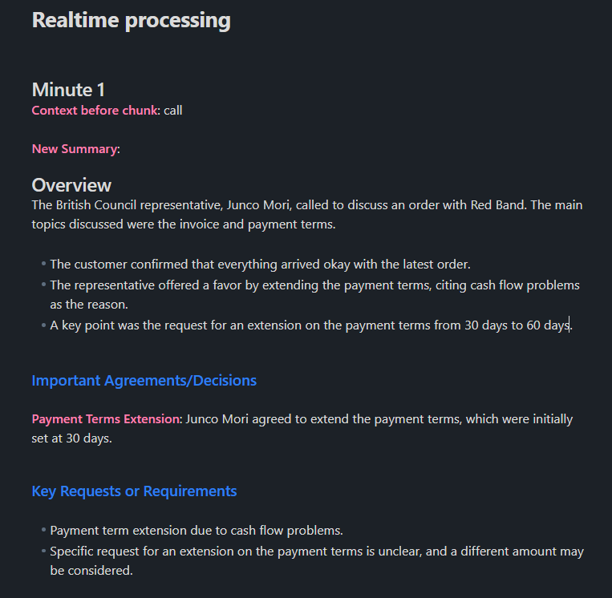

# Neural Meet AI: Real-Time Audio Transcription & Summarization Tool

Neural Meet AI is an innovative, AI-powered application designed to transform spoken content into structured, actionable insights. Leveraging state-of-the-art models like OpenAI’s Whisper along with advanced NLP, this tool efficiently transcribes and summarizes audio from meetings, lectures, and phone calls. Whether you’re a professional looking to streamline meeting notes, an educator capturing lecture highlights, or a developer integrating audio analysis into your workflow, Neural Meet AI simplifies the process with real-time processing and intelligent summarization.

<p align="center"> 
  
   
</p>

---

## Features

### Real-Time Audio Processing
- **Live Transcription:** Capture and transcribe audio in real-time using a multi-threaded processing framework.
- **Flexible Input:** Supports a variety of media formats including recorded meetings, lectures, and phone calls.

### Intelligent Summarization
- **Automated Note-Taking:** Automatically generate concise, structured summaries from transcribed content.
- **Customizable Summaries:** Adjust summarization intervals and context settings to match your needs.

### Versatile File Support & API Integration
- **Batch & Live Modes:** Process pre-recorded audio/video files or utilize live audio capture for immediate insights.
- **Extendable Architecture:** Integrate seamlessly via RESTful API endpoints for enhanced workflow automation.

### Robust Error Handling & Optimization
- **Efficient Processing:** Optimize transcription speed and accuracy with advanced model integration and error management.
- **Real-Time Feedback:** Receive immediate logs and feedback during processing to ensure reliable operation.

---

## Getting Started

### Installation

1. **Clone the Repository:**
```bash
   git clone https://github.com/your-username/neural-meet-ai.git
```

2. **Install Dependencies:**
Navigate to the project directory and install the required packages:
```bash
   cd neural-meet-ai
   pip install -r requirements.txt
```
3. **Run the Application:**

For Full Audio Processing:  
Execute the main script to process a **complete audio**, **video file** or **real-time** transcription:  
```bash
   python main.py
```

## How to Use
### Processing a Full Audio/Video File
- **Select Mode**: Choose full-file processing mode from the command-line prompt.   
- **Specify File Type**: Indicate whether the file is a meeting, lecture, or call.  
- **Generate Output**: The application will transcribe the audio and generate a detailed summary saved as a text file.  

### Real-Time Transcription
-  **Live Mode**: Activate real-time processing to capture and process live audio from your microphone.  
-  **Instant Insights**: Enjoy minute-by-minute summaries displayed on your screen and saved to an output file.

### API Integration
-  **LLama 3.2 3B**: Use your own model or API with any existing model
  
  
## Real-World Applications
**Business Meetings**:   
- Automatically generate meeting minutes and action items.  
  
**Education**:  
- Transcribe lectures and create organized study notes.  
  
**Customer Support**:  
- Analyze call recordings for quality assurance and insights.
  
**Documentation**:  
- Create searchable, structured records of conversations for future reference.   

  
## Tech Stack
**Languages**:
- **Python**

**Key Libraries & Tools**:
- **OpenAI Whisper** – For high-accuracy audio transcription.
- **PyAudio** – For capturing live audio input.
- **Requests** – For handling HTTP requests during processing.


## Code Example
``` bash
from neural_meet import run_audio_file_processing

# Define your media file path and type (e.g., "meeting", "lecture", or "call")
MEDIA_FILE = "path/to/your/audio_file.mp3"
run_audio_file_processing(MEDIA_FILE, file_type="meeting")
```
This snippet demonstrates how to transcribe and summarize an audio file using Neural Meet AI.

Contributing
Contributions are welcome! To contribute:
1. **Fork the Repository**: Create your own fork of Neural Meet AI.
2. **Create a Feature Branch**:
```bash
git checkout -b feature/your-feature-name
```
3. **Commit Your Changes**: Write clear, descriptive commit messages.
4. **Submit a Pull Request**: Provide a detailed explanation of your changes for review.


## License
This project is licensed under the MIT License. See the LICENSE file for details.
